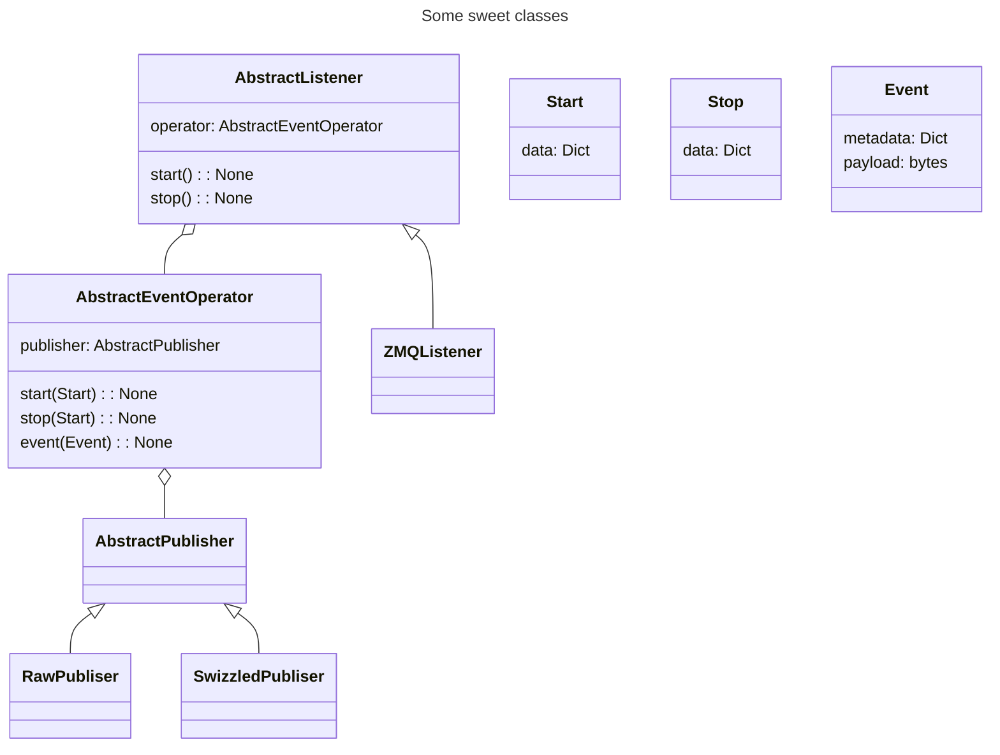

# What is this?
This is an initial design for 

```mermaid
---
title: Some sweet classes

note: I guess we use "None" instead of "void"
---

classDiagram

    class AbstractListener{
        operator: AbstractEventOperator

        start(): None  
        stop(): None
    }


    class AbstractEventOperator{
        publisher: AbstractPublisher
        start(Start): None
        stop(Start): None
        event(Event): None
    }

    class AbstractPublisher{

    }


    class Start{
        data: Dict
    }
   
    class Stop{
        data: Dict
    }

    class Event{
        metadata: Dict
        payload: bytes
    }

    class ZMQListener{

    }

    AbstractListener <|-- ZMQListener
    AbstractListener o-- AbstractEventOperator

    AbstractPublisher <|-- RawPubliser
    AbstractPublisher <|-- SwizzledPubliser
    AbstractEventOperator o-- AbstractPublisher
    
    

```
