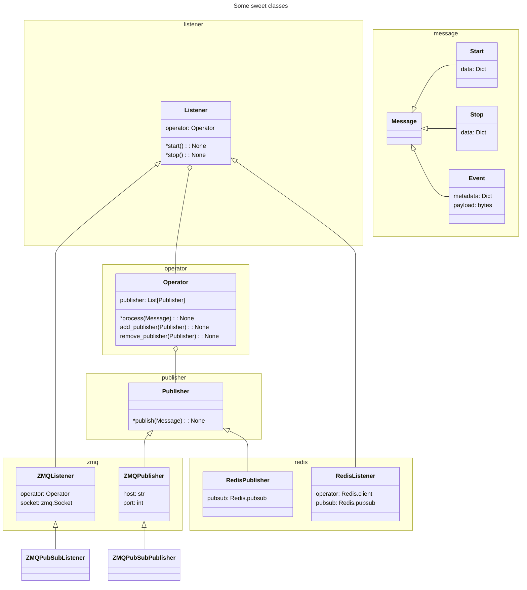
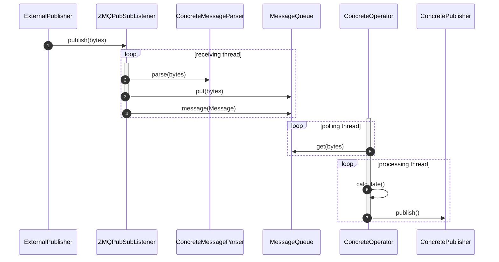

# Arroyo Stream Processing Toolset

Processing event or streaming data presents several technological challenges. A variety of technologies are often used by scientific user facilities. ZMQ is used to stream data and messages in a peer-to-peer fashion. Message brokers like Kafka, Redis and RabbitMQ are often employed to route and pass messages from instruments to processing workflows. Arroyo provides an API and structure to flexibly integrate with these tools and incorporate arbitrarily complex processing workflows, letting the hooks to the workflow code be independent of the connection code and hence reusable at a variety of instruments. 

The basic structure of building an arroyo implementation is to implement groups of several  classes:
- 
- `Operator` - receives `Messages` from a listener and can optionally send `Messages` to one or more `Publisher` instances
- `Listener` - receives `Messages` from the external world, parse them into arroyo `Message` and sends them to an `Operator`
- `Publisher` - receives `Messages` from a `Listener` and publishes them to the outside world

Arroyo is un-opinionated about deployment decsions. It is intended support listener-operator-publisher groups in:
- Single process
- Chain of processes where listening, processing and publishing can linked together through a protocol like ZMQ. One process's publisher can communicate with another process's listener, etc.

This library is intended to provide  classes, and will also include more specific common subclasses, like those that communicate over ZMQ or Redis.

##
In-process, listening for ZMQ

Note that this leaves Concrete classes undefined as placeholders

TODO: parent class labels

