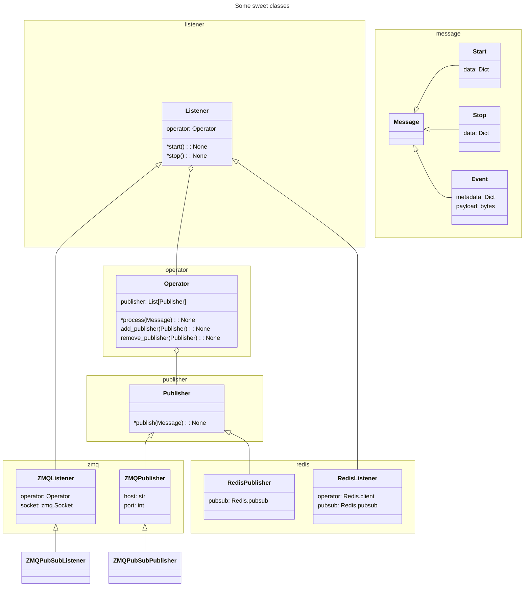
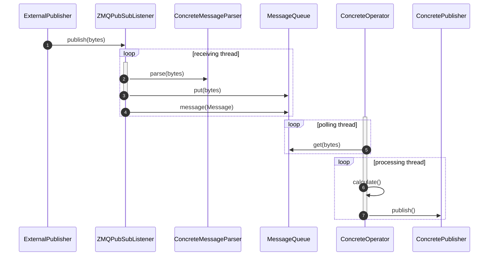

# Arroyo Stream Processing Toolset

Processing event or streaming data presents several technological challenges. A variety of technologies are often used by scientific user facilities. ZMQ is used to stream data and messages in a peer-to-peer fashion. Message brokers like Kafka, Redis and RabbitMQ are often employed to route and pass messages from instruments to processing workflows. Arroyo provides an API and structure to flexibly integrate with these tools and incorporate arbitrarily complex processing workflows, letting the hooks to the workflow code be independent of the connection code and hence reusable at a variety of instruments.

## Core Concepts

The basic structure of building an arroyo implementation is to implement groups of several classes:

- `Operator` - receives `Messages` from a listener and can optionally send `Messages` to one or more `Publisher` instances
- `Listener` - receives `Messages` from the external world, parse them into arroyo `Message` and sends them to an `Operator`
- `Publisher` - receives `Messages` from a `Listener` and publishes them to the outside world
- `Unit` - a container that holds one operator with any number of listeners and publishers

## Configuration-Based Deployment

Arroyo supports declarative configuration via YAML files, making it easy to deploy and configure pipelines without writing code:

```yaml
name: my_pipeline
description: Process messages from ZMQ

operator:
  class: myapp.operators.MessageProcessor
  kwargs:
    timeout: 30

listeners:
  - class: arroyopy.zmq.ZMQListener
    kwargs:
      address: 'tcp://127.0.0.1:5555'

publishers:
  - class: arroyopy.redis.RedisPublisher
    kwargs:
      channel: processed_data
```

Run from the command line:
```bash
arroyo-run config/pipeline.yaml
```

See [docs/configuration.md](docs/configuration.md) for full details.

## Deployment Options

Arroyo is un-opinionated about deployment decisions. It is intended to support listener-operator-publisher groups in:
- Single process
- Chain of processes where listening, processing and publishing can be linked together through a protocol like ZMQ. One process's publisher can communicate with another process's listener, etc.
- Configuration-based deployment via YAML files and CLI

This library is intended to provide base classes, and will also include more specific common subclasses, like those that communicate over ZMQ or Redis.



```mermaid

---
title: Some sweet classes

note: I guess we use "None" instead of "void"
---

classDiagram
    namespace listener{

        class Listener{
            operator: Operator

            *start(): None
            *stop(): None
        }


    }

    namespace operator{
        class Operator{
            publisher: List[Publisher]
            *process(Message): None
            add_publisher(Publisher): None
            remove_publisher(Publisher): None

        }
    }

    namespace publisher{
        class Publisher{
            *publish(Message): None
        }

    }

    namespace message{

        class Message{

        }

        class Start{
            data: Dict
        }

        class Stop{
            data: Dict
        }

        class Event{
            metadata: Dict
            payload: bytes
        }
    }

    namespace zmq{
        class ZMQListener{
            operator: Operator
            socket: zmq.Socket
        }

        class ZMQPublisher{
            host: str
            port: int
        }

    }

    namespace redis{

        class RedisListener{
            operator: Redis.client
            pubsub: Redis.pubsub
        }

        class RedisPublisher{
            pubsub: Redis.pubsub
        }

    }


    Listener <|-- ZMQListener
    ZMQListener <|-- ZMQPubSubListener
    Listener o-- Operator

    Publisher <|-- ZMQPublisher
    ZMQPublisher <|-- ZMQPubSubPublisher

    Publisher <|-- RedisPublisher
    Listener <|-- RedisListener
    Operator o-- Publisher
    Message <|-- Start
    Message <|-- Stop
    Message <|-- Event


```
##
In-process, listening for ZMQ

Note that this leaves Concrete classes undefined as placeholders

TODO: parent class labels


```mermaid

sequenceDiagram
    autonumber
    ExternalPublisher ->> ZMQPubSubListener: publish(bytes)
    loop receiving thread
        activate ZMQPubSubListener
            ZMQPubSubListener ->> ConcreteMessageParser: parse(bytes)
            ZMQPubSubListener ->> MessageQueue: put(bytes)
        deactivate ZMQPubSubListener


        ZMQPubSubListener ->> MessageQueue: message(Message)
    end
    activate ConcreteOperator
        loop polling thread
            ConcreteOperator ->> MessageQueue: get(bytes)
        end
        loop processing thread
            ConcreteOperator ->> ConcreteOperator: calculate()

            ConcreteOperator ->> ConcretePublisher: publish()
        end
    deactivate ConcreteOperator
```

# Developer Installation

Arroyopy supports multiple development setups. Choose the one that fits your workflow:

## Option 1: Pixi (Recommended)

[Pixi](https://pixi.sh) provides reproducible environments across all platforms with automatic dependency resolution.

### Install Pixi

```bash
# macOS/Linux
curl -fsSL https://pixi.sh/install.sh | bash

# Or with homebrew
brew install pixi
```

### Setup Development Environment

```bash
# Clone and navigate to the repository
git clone https://github.com/als-computing/arroyopy.git
cd arroyopy

# Install all dependencies (automatically creates environment)
pixi install

# Install in editable mode
pixi run install-dev
```

### Common Pixi Tasks

```bash
# Run tests
pixi run test

# Run tests with coverage
pixi run test-cov

# Format code
pixi run format

# Check formatting
pixi run format-check

# Run linter
pixi run lint

# Run pre-commit checks
pixi run pre-commit

# Install pre-commit hooks
pixi run pre-commit-install

# Clean build artifacts
pixi run clean
```

### Using Different Environments

```bash
# Use dev environment (includes all optional dependencies)
pixi shell -e dev

# Use minimal environment (only core dependencies)
pixi shell -e minimal

# Use production environment (core + optional features)
pixi shell -e prod

# Run tests in dev environment
pixi run -e dev test
```

## Option 2: Conda/Mamba Environment

If you prefer conda/mamba without pixi:

```bash
# Create environment
conda create -n arroyopy python=3.11
conda activate arroyopy

# Install in editable mode with dev dependencies
pip install -e '.[dev]'
```

## Option 3: Virtual Environment (venv)

For a pure Python approach:

```bash
# Create virtual environment
python -m venv .venv
source .venv/bin/activate  # On Windows: .venv\Scripts\activate

# Install in editable mode with dev dependencies
pip install -e '.[dev]'
```

## Installation Options

### Basic Installation

```bash
pip install arroyopy
```

### With optional dependencies

```bash
# Install with ZMQ support
pip install arroyopy[zmq]

# Install with Redis support
pip install arroyopy[redis]

# Install with file watching support
pip install arroyopy[file-watch]

# Install with multiple options
pip install arroyopy[zmq,redis]

# Install everything for development
pip install arroyopy[dev]
```

## Pre-commit Hooks
## Pre-commit Hooks

We use `pre-commit` for code quality checks. It's included in the dev dependencies.

### Setup (Pixi)

```bash
If pre-commit makes changes (e.g., with `black`), review them and add to your commit:

```bash
git add .
# Then run pre-commit again
pixi run pre-commit  # or: pre-commit run --all-files
```

## Running Tests

### With Pixi

```bash
# Run all tests
pixi run test

# Verbose output
pixi run test-verbose

# With coverage report
pixi run test-cov
```

### With pip/conda

```bash
# Run all tests
pytest src/_test/

# With coverage
pytest src/_test/ --cov=src/arroyopy --cov-report=html
```

## Project Structureuse `pixi` for CI in github action. It's great for that but can't get our favorite developr tools to use the python environments that `pixi` creaetes in the `.pixi` folder. If you want to play with `pixi`, here are some tips:

To setup a development environment:

* Git clone this repo and CD into the directory
* Install [pixi](https://pixi.sh/v0.33.0/#installation)
* Install dependencies with
'''
pixi install
'''
* run pre-commit on the files
'''
pixi r pre-commit
'''


* Run pytest with
'''
pixi r test
'''

# Copyright
Arroyo Stream Processing Toolset (arroyopy) Copyright (c) 2025, The Regents of the University of California, through Lawrence Berkeley National Laboratory (subject to receipt of any required approvals from the U.S. Dept. of Energy).
All rights reserved.

If you have questions about your rights to use or distribute this software,
please contact Berkeley Lab's Intellectual Property Office at
IPO@lbl.gov.

NOTICE.  This Software was developed under funding from the U.S. Department
of Energy and the U.S. Government consequently retains certain rights.  As
such, the U.S. Government has been granted for itself and others acting on
its behalf a paid-up, nonexclusive, irrevocable, worldwide license in the
Software to reproduce, distribute copies to the public, prepare derivative
works, and perform publicly and display publicly, and to permit others to do so.
