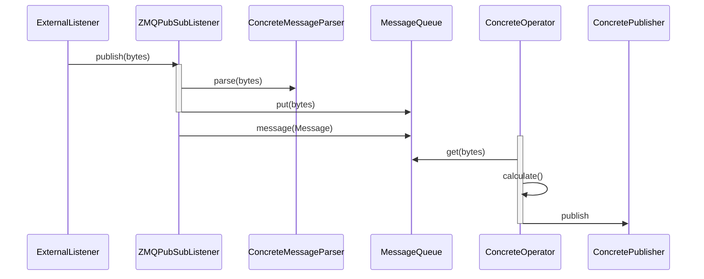

# Arroyo is Spanish for stream
This is an initial design for a library intended to be used in a variety of streaming processing scenario.

This is intended to provide classes that can be used in a wide variety of processing scenarios
- Single process
- Chain of processes where listening, processing and publishing can linked together through a protocol like ZMQ. One process's publisher can communicate with another process's listener, etc.

This library is intended to provide abstract classes, and will also include more specific common subclasses, like those that communicate over ZMQ.

##
In-process, listening for ZMQ

Note that this leaves Concrete classes undefined as placeholders

TODO: thread groups, parent class labels

